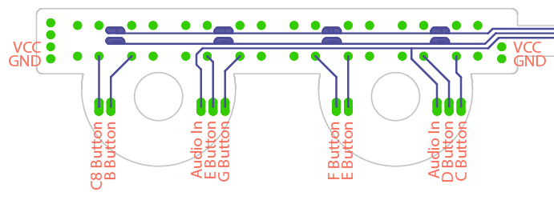
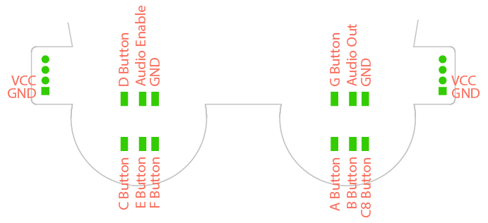
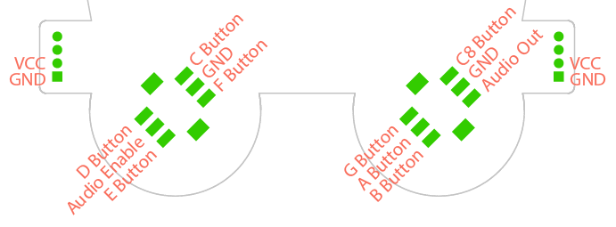

# Ox Vox

The Ox Vox is a badge add-on created for the DEF CON 25 503 party and BSides PDX 2018 badges. The Ox Vox replaces the two joysticks on the badge with eight buttons and amplified speaker output.

## How To

### Connecting

Connecting the Ox Vox requires removing the joysticks from the badge. The pinouts are different for the DC25 Badge vs the BSides badge, so a few defines need to be changed depending on which badge you are modifying. Each joysticks uses five GPIOs, which allows for eight button inputs (a full octave), audio out, and an amplifier enable (see [Addition](#additions)).

Below shows how to connect the Ox Vox depending on which badge you're modifying.

#### DEF CON 25 503 Party Badge

#### BSides PDX Badge

### Programming

There are a few methods for programming the BMD-300 (NRF52832) SoC with the Ox Vox firmware via SWD. For this this project, I've been using the [BMD-300 Eval Kit](https://www.digikey.com/product-detail/en/rigado-inc/BMD-300-EVAL/1604-1007-ND/5958042) as a Segger J-Link Debugger as outlined in [this article](https://rigado.zendesk.com/hc/en-us/articles/223486428-How-are-the-BMD-200-and-BMD-300-Series-modules-programmed-). There are many cheap (<$10) J-Link-OB devices available that will likely work just as well, or you can probably use any other SWD device you have laying around.

In order to program the board, you need to break out the SWD interface. This requires soldering four male header pins to the pads shown below (directly below the i2c screen header). Looking at the badge from the back, the pins are SWCLK, SWDIO, 3v3, and GND.

If you're using a J-Link interface, the badge should show mount to your OS when you plug it into your computer. You can then drop the appropriate (DC25 vs BSides) compiled hex file into the mounted folder and the NRF52 will take it from there.

If you want to build from source, follow [this guide](https://www.rigado.com/bmd-300-series-getting-started-guide/?wpdmdl=1810) (starting on page 9) for setting up Keil uVision, the nRF5 SDK, and Segger J-Link. Instead of downloading nRF5 SDK v12, download [nRF5 SDK v13.0.0](https://developer.nordicsemi.com/nRF5_SDK/nRF5_SDK_v13.x.x/) (it's possible this code will work with newer SDKs, but I have not tested with them).

## Hardware

PCB files, designed in Eagle v7.7.0, are included in the Hardware folder. The design features eight momentary-push buttons, a basic smoothing and amplifier circuit, and a .8W speaker. The buttons form a full octave keyboard from C (261.6 Hz) to C (523.3 Hz). The BMD-300 outputs a PWM signal that is smoothed and amplified by the LM4861 amplifier.

## Firmware

To build the project, drop the oxvox foldering into examples->peripheral in the SDK and drop components into the root of the SDK (it fixes a bug in the bsp driver and adds the board definitions to the boards folder). Opening oxvox.uvprojx will open the project in uVision. From there you can build and load the hex file onto the board (either by grabbing the hex file in \_build/ and dropping it onto the mounted JLINK device or by using uVision's load feature). If you're using uVision to load the firmware, make sure it is configured to support whatever SWD programmer you are using; you can configure this under Project->Options for Target->Debug.

## Additions

The Ox Vox amplifier, in combination with the OLED display, were quickly draining fresh batteries, so as proposed by [Scanlime](https://twitter.com/scanlime), I added support in the firmware to connect the shutown pin of the LM4861 to pin xxx of the BMD-300. This allows the amplifier to be turned off when no audio is being played in order to save some power, and so it doesn't compete with the current draw when the display is drawing more white pixels in the default image. In order to do this, the shutdown lead (highlighted below) needs to be desoldered and lifted off the pad, then wired to the xxx pad on the Badge. The shutdown pin was originally connected to ground so the amplifier would remain on, therefore part of the trace is under the LM4861. The easiest way to break that connection is to lift the lead instead of disconnect the pad.